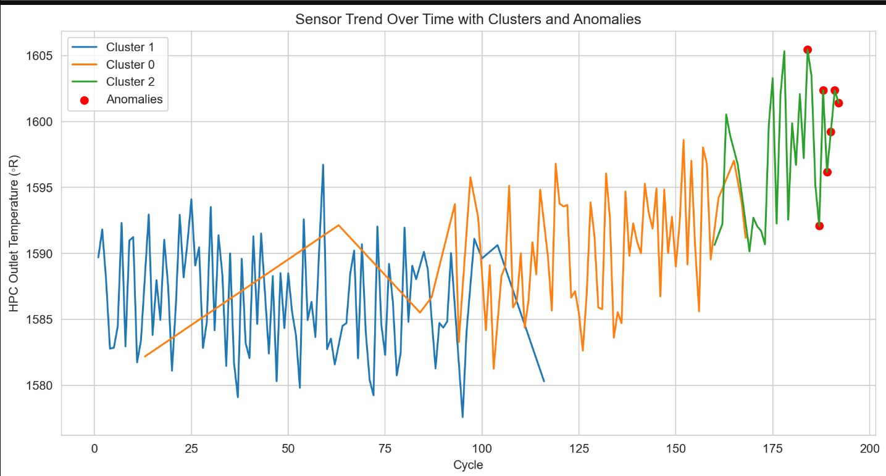
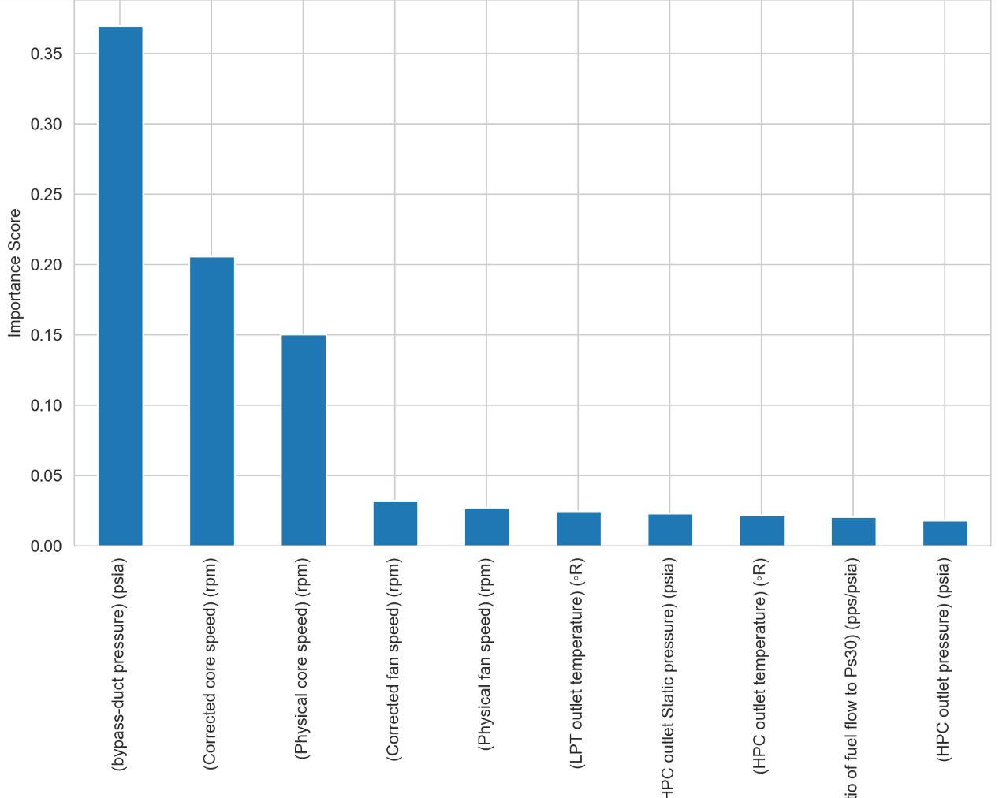

# Anomaly Detection Using K-Means Clustering and Random Forest Classification

# Project Overview: In this project, I developed a comprehensive anomaly detection system for sensor data obtained from complex machinery. The primary objective was to identify deviations from normal operating conditions, which could indicate potential system failures or maintenance needs.

# Key Steps and Techniques:

1. Data Collection and Preprocessing:

Utilized the CMAPSS dataset, which includes multivariate time-series sensor data from jet engines.
Performed data cleaning to handle missing values and outliers, ensuring the dataset's integrity.

2. Exploratory Data Analysis (EDA):

Conducted statistical analyses to understand the distribution and relationships within the data.
Visualized sensor readings over time to identify patterns and potential anomalies.

3. .Feature Engineering:

Created new features to capture the dynamics of the system, enhancing the model's predictive capabilities.
Normalized and scaled features to ensure compatibility with clustering algorithms.

4. K-Means Clustering for Anomaly Detection:

Applied K-Means clustering to group similar operational states of the machinery.
Identified clusters representing normal operations and flagged outliers as potential anomalies.

5. Random Forest Classification:

Developed a Random Forest classifier to predict anomalies based on the engineered features.
Evaluated model performance using metrics such as AUC-ROC, F1-Score, Precision, and Recall, achieving high accuracy in anomaly detection.

6. Visualization and Reporting:

Created visualizations to illustrate sensor trends, clustering results, and model performance.
Compiled findings into a comprehensive report, highlighting the system's effectiveness in detecting anomalies.

## Outcome: The project successfully demonstrated the integration of unsupervised and supervised learning techniques to detect anomalies in complex systems. The approach can be applied to various industrial applications, enhancing predictive maintenance strategies and reducing downtime.

## View the Rendered Notebook

You can explore the full analysis and results in the rendered Jupyter Notebook:

[Click here to view the notebook on nbviewer](https://nbviewer.org/github/janetcheung-byte/predictive_maintenance_model/blob/main/randomforest_classifier.ipynb)

## Key Results

K-Means Clustering and Anomaly Distribution

Clusters were identified using K-Means, with a hypothesized number of clusters (“k=3”) representing three operational states:

1. Normal State

2. Degraded State

3. Anomalous State

## Proportion of Anomalies:

### Training Set:

* Cluster 0: 0.887% anomalies

- Cluster 1: 5.469% anomalies

- Cluster 2: 13.406% anomalies

### Test Set:

- Cluster 0: 0.482% anomalies

- Cluster 1: 5.398% anomalies

- Cluster 2: 3.800% anomalies

### Interpretation: Clusters 1 and 2 exhibit higher proportions of anomalies, aligning with degraded or anomalous operational states.

## Random Forest Classifier Performance

The Random Forest model performed exceptionally well in identifying anomalies in both training and test datasets.

## Metrics Summary:

### Training Data:

AUC-ROC: 1.0000

F1-Score: 1.0000

Precision: 1.0000

Recall: 1.0000

### Test Data:

AUC-ROC: 1.0000

F1-Score: 0.9930

Precision: 1.0000

Recall: 0.9862

###  Confusion Matrix:

#### Training Data:

True Negatives: 19,599

False Positives: 0

False Negatives: 0

True Positives: 1,032

### Test Data:

True Negatives: 12,662

False Positives: 0

False Negatives: 6

True Positives: 428

# Key Observations:

No overfitting: The model generalizes well, as test metrics closely align with training metrics.

High precision (1.0000) and recall (0.9862) ensure confident and accurate anomaly detection.

# Top Features Contributing to Anomalies

The Random Forest model identified the following as the most significant features contributing to anomalies:

(bypass-duct pressure) (psia): 36.98%

(Corrected core speed) (rpm): 20.56%

(Physical core speed) (rpm): 15.02%

(Corrected fan speed) (rpm): 3.23%

(Physical fan speed) (rpm): 2.73%

### Interpretation: Pressure and core speed readings play critical roles in anomaly detection, suggesting that system pressure dynamics and speed deviations are primary indicators of operational issues.

# Visualizations

## Sensor Trends Over Time

The plot below illustrates sensor trends over time, segmented by clusters, with anomalies highlighted in red:

Clusters: Represent operational states.

Red Points: Indicate anomalies.

# Feature Importance

The bar chart below shows the top contributing features to anomalies as determined by the Random Forest model:

Conclusions

The clustering approach effectively segments operational states, highlighting higher anomaly proportions in specific clusters.

The Random Forest classifier demonstrates exceptional precision and recall, ensuring robust anomaly detection.

Feature importance analysis reveals key system parameters driving anomalies, providing actionable insights for system monitoring and optimization.

